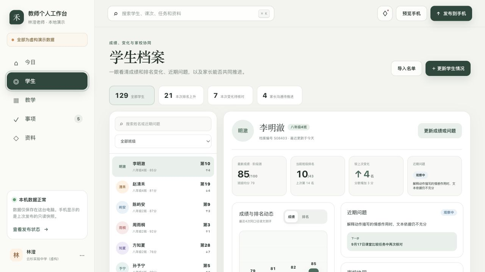
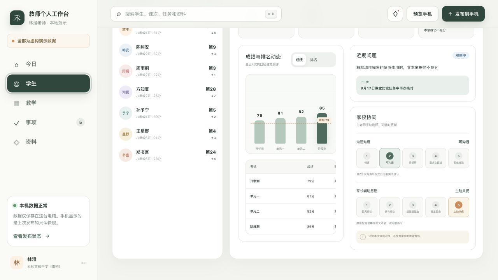
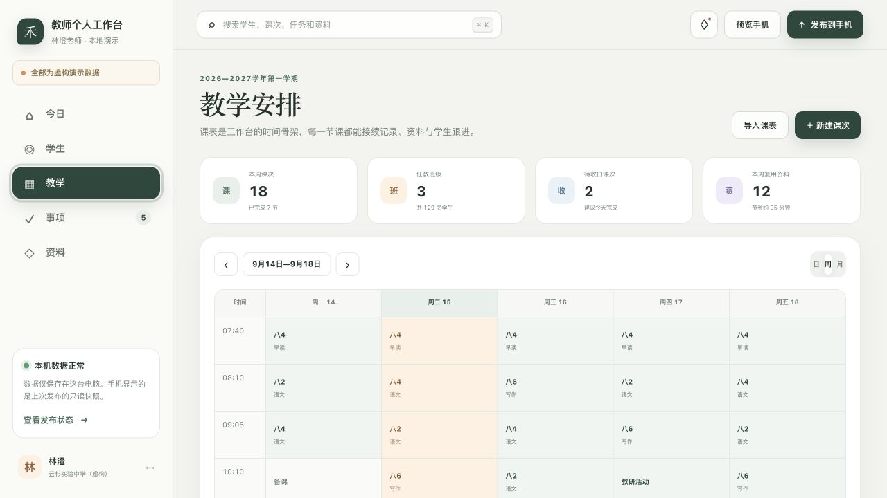
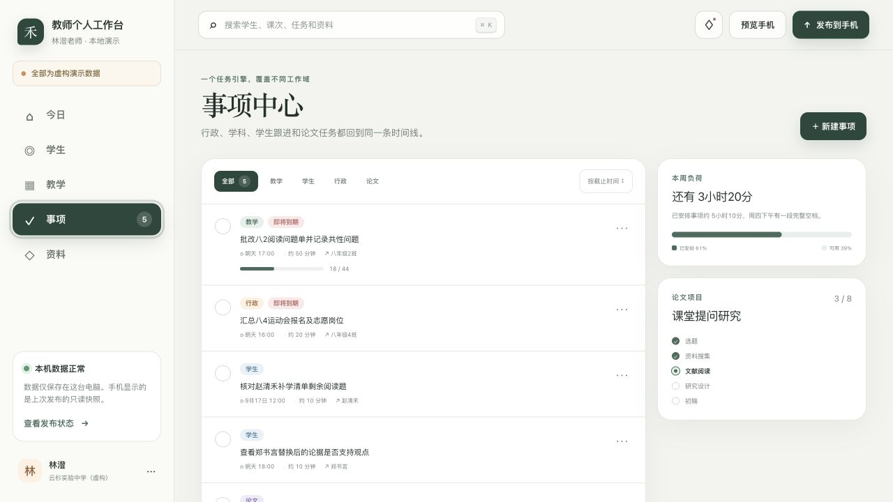
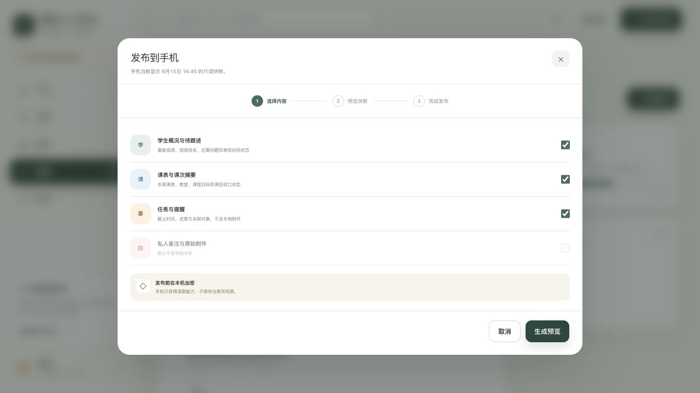
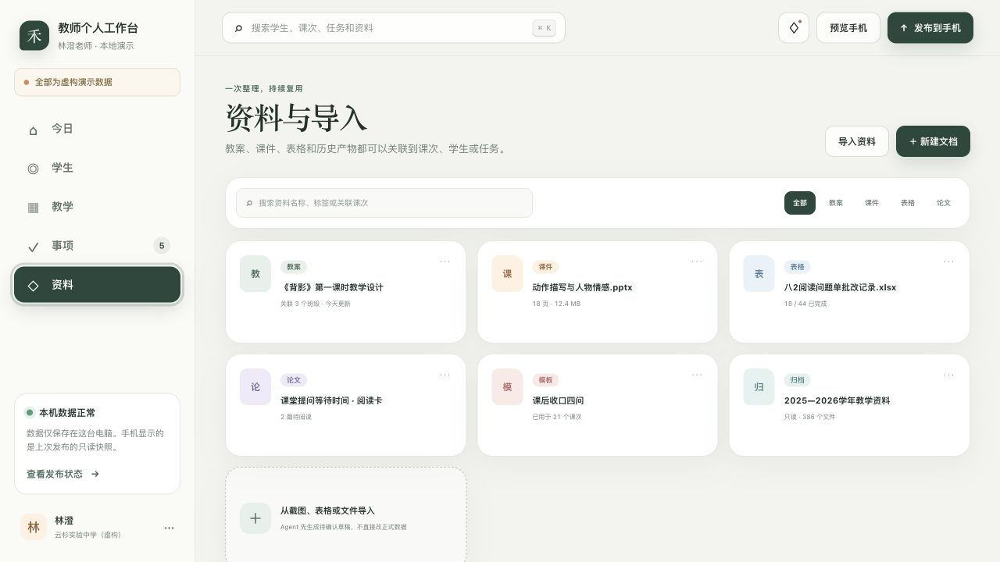

# 教师个人工作台：深化阶段审计与工作清单

日期：2026-08-04

## 结论

功能板块已经足够，下一阶段冻结导航和模块，不再增加页面。目标从“高保真演示”转为“可售、可长期自用的首版”，只做四件事：数据真实、现有操作闭环、手机真正只读、交付可复现。

## 1. 首页：结构健康，可信度不足

- 学生动态已经成为第二重点，方向正确。
- 首页数字、日期、任务数量和学生汇总目前仍是固定演示值。
- “约35分钟”与三项任务合计80分钟不一致。
- “Agent待确认、变更草稿、尚未写入正式数据、本机数据、只读快照”等实现语言不应出现在老师日常界面。
- 首页的学生、任务、课次和家校状态必须全部由同一份真实数据计算。

健康度：结构健康；内容可信度和数据联动不合格。

## 2. 学生档案：核心方向正确，数据模型尚未成立

现有重点正确：成绩、排名、进退步、近期问题、家校协同。

需要把每次成绩定义为独立记录：

- 测评名称、日期、学科、满分、成绩；
- 排名、参与人数、班级均分；
- 数据来源、是否已核对；
- 进退步只由相邻真实测评计算，不推算不存在的历史排名。

近期问题只保留：问题、处理状态、下一步、复核日期、最后更新时间。

家校协同只保留：沟通难度、辅助意愿、简短说明、更新时间。由老师手动选择，不由 AI 自动判断。

当前问题：

- 129、21、7、4 等汇总数字写死；129也超出已确认的80—100人上限。
- 更新学生情况后没有真正修改学生数据。
- 家校等级只保存在当前页面内存中，刷新后丢失，首页也不会同步。
- “成绩/排名”切换和四个汇总按钮看起来可点，但没有完整行为。
- 档案编号属于内部字段，普通页面应隐藏。
- 次级文字偏小，需统一提高可读性。

健康度：信息结构正确；保存、统计和历史数据不合格。

## 3. 教学安排：课表结构清楚，课次没有对应起来

课表记录应稳定为：班级、学科、星期、起止时间、地点、学期循环范围、提醒时间。

当前问题：

- 点击“备课、写作、语文、班会”等不同课表格，均打开同一个固定的“八年级4班班会”详情。
- 上一周、下一周、日/周/月已经显示为控件，但没有完整行为。
- 课表导入仍是演示步骤，没有实际文件读取、字段对应、问题核对与保存。
- 所有课次统计必须由课表数据计算，不再写死。

健康度：展示健康；课次对应、切换和导入闭环不合格。

## 4. 事项中心：分类合理，新增与保存尚未闭环

事项字段固定为：类别、标题、截止时间、状态、关联学生或班级、提醒时间、预计用时。

当前问题：

- “新建事项”打开的是“更新学生情况”表单，入口与结果错配。
- 完成状态只存在当前页面，刷新后恢复。
- 排序按钮和更多按钮没有完整行为。
- “本周负荷、完成比例、项目进度”只有在真实计算成立后才能显示。

健康度：内容分类健康；新增、编辑、保存和统计不合格。

## 5. 手机更新：概念正确，技术语言暴露

老师界面统一使用：

- 识别 → 核对 → 保存；
- 智能整理 → 确认或修改；
- 更新手机看板；
- 手机仅供查看。

老师日常界面不出现：Agent、正式数据、写入、解析、快照、仓库、密钥、令牌、Git、变更、配对、数据包。

建议替换：

| 当前文字 | 老师界面 |
|---|---|
| Agent待确认 / 变更草稿 | 智能整理待确认 / 整理建议 |
| 尚未写入正式数据 | 确认前不会保存 |
| 发布到手机 | 更新手机看板 |
| 只读快照 | 仅供查看 |
| 解析 / 置信度高 | 识别 / 已识别，请核对 |
| 本机数据正常 | 内容已保存 |
| 采用这项变更 | 保存为事项 |

加密方式、AI密钥、Git仓库、令牌、写入权限、首次连接方式只保留在安装说明或维护说明中；不是用 CSS 藏起来，而是不进入客户日常界面。

手机只读也必须在数据层拒绝写操作，不能仅依靠隐藏按钮或屏幕宽度判断。

健康度：流程概念正确；语言、数据隔离和只读约束不合格。

## 6. 资料：作为辅助板块保留，不继续扩展

- “Agent先生成待确认草稿、不直接改正式数据”改为“系统先整理内容，确认后保存”。
- “历史产物”改为“历史资料”。
- 搜索、筛选、新建文档如果首版不做，就改成静态展示或隐藏，不能保留假按钮。
- 不增加新的资料分类、协作或云盘功能。

健康度：范围合适；技术文案和假控件需清理。

## P0：下一轮立即处理

1. 清除技术语言和设计稿语言，正式客户版隐藏演示标识、档案编号及所有仓库/密钥/加密说明。
2. 修正可信度错误：35分钟与80分钟不一致、129人超出既定规模、推算历史排名、固定汇总数字。
3. 修正入口错配：课表格必须打开对应课次；新建事项必须进入事项表单。
4. 所有可见按钮要么工作，要么首版隐藏：周切换、日/周/月、成绩/排名、学生汇总筛选、任务排序与更多、资料筛选与新建。
5. 定稿学生、课表、事项三类数据字段，并让首页和各详情页使用同一份数据。
6. 完成真实本地保存；刷新或重启后，成绩、任务状态和家校等级仍存在。
7. 手机路径真正只读，任何修改请求都被拒绝。

## P1：可售首版完成工作

1. 导入闭环：选择文件 → 字段对应 → 问题核对 → 确认保存 → 结果反馈。
2. 补齐空数据、字段缺失、重复学生、重复测评、保存失败、识别失败和手机更新失败状态。
3. 首次初始化：工作台名称、老师、学校、角色、学段、学科、学期、班级、课表映射、默认提醒、演示数据清除。
4. Windows/macOS实机检查：启动脚本、字体、字符图标、中文文件名、路径、日期格式；Windows显示Ctrl K而不是⌘ K。
5. 销售交付包：私有仓库、版本标签、授权文件、双系统安装说明、初始化清单、验收单、版本记录、校验值。
6. 测试补齐：保存与刷新、导入、课次对应、手机只读、错误恢复和关键响应式布局。

## 当前工程质量信号

- 构建与服务端渲染冒烟测试通过。
- 自动化测试目前仅证明页面能渲染，不能证明保存、导入、持久化或手机只读。
- `npm run lint` 当前有1个错误：`cloudflare-env.d.ts` 的空接口规则。
- 当前目录不是 Git 仓库。
- 现有 ZIP 早于最新源码修改，不应作为下一次交付包。

## 验收标准

- 老师界面扫描不到 Agent、Git、仓库、令牌、密钥、加密数据包、正式数据、写入等词。
- 任意可见按钮都有真实结果；没有结果的按钮不显示。
- 更新一名学生后，详情、列表、首页、搜索和汇总同步变化，刷新后仍存在。
- 任意课表格打开的班级、学科、时间与该格一致。
- 手机端无法通过任何入口修改电脑数据。
- 演示数据可一次清除，80—100名学生规模下操作稳定。
- Windows和macOS都能按交付说明独立启动。

